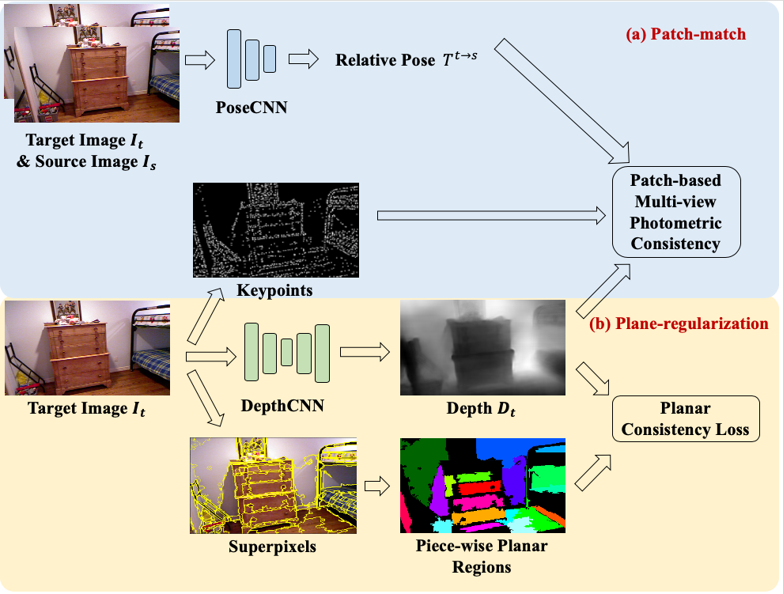

# Indoor SfMLearner

PyTorch implementation of our ECCV2020 paper:

[Patch-match and Planar-regularization for Unsupervised Indoor Depth Estimation](https://svip-lab.github.io/)

Zehao Yu\*,
Lei Jin\*,
[Shenghua Gao](http://sist.shanghaitech.edu.cn/sist_en/2018/0820/c3846a31775/page.htm)

(\* Equal Contribution)



## Getting Started

### Installation


### Download pretrained model
Please download pretrained model from [Onedrive](https://onedrive.live.com/?authkey=%21ANXK7icE%2D33VPg0&id=C43E510B25EDDE99%21106&cid=C43E510B25EDDE99) and extract:
```bash
tar -xzvf ckpts.tar.gz 
```

### Prediction on sigle image                                                                                  
Run the following command to predict on a single image:
```bash
python inference_single_image.py --image_path=/path/to/image
```
By default, the script saves the predicted depth to the same folder

## Evaluation                                                                                                     
Download testing data from [Onedrive](https://onedrive.live.com/?authkey=%21ANXK7icE%2D33VPg0&id=C43E510B25EDDE99%21106&cid=C43E510B25EDDE99) and extract to ./data.

### NYUv2 Dpeth
```bash
CUDA_VISIBLE_DEVICES=1 python evaluation/nyuv2_eval_depth.py \
    --data_path PATH_NYU_TEST \
    --load_weights_folder ckpts/weights_5f \
    --post_process  
```

### NYUv2 normal
```base
CUDA_VISIBLE_DEVICES=1 python evaluation/nyuv2_eval_norm.py \
    --data_path PATH_NYU_TEST \
    --load_weights_folder ckpts/weights_5f \
    # --post_process
```

### ScanNet Depth
```base
CUDA_VISIBLE_DEVICES=1 python evaluation/scannet_eval_depth.py \                                               
    --data_path PATH_SCANNET_TEST \
    --load_weights_folder ckpts/weights_5f \
    --post_process

```

### ScanNet Pose
```base
UDA_VISIBLE_DEVICES=1 python evaluation/scannet_eval_pose.py \                                                
    --data_path PATH_SCANNET_POSE \
    --load_weights_folder ckpts/weights_5f \
    --frame_ids 0 1
```

## Training
First download [NYU Depth V2](https://cs.nyu.edu/~silberman/datasets/nyu_depth_v2.html) on the official website and unzip the raw data to DATA_PATH.

### Extract Superpixel
Run the following command to extract superpixel:
```bash
python extract_superpixel.py --data_path DATA_PATH --output_dir ./data/segments
```

### 3-frames
Run the following command to train our network:
```bash
CUDA_VISIBLE_DEVICES=1 python train_geo.py \                                                                   
    --model_name 3frames \
    --data_path DATA_PATH \
    --val_path PATH_NYU_TEST \
    --segment_path ./data/segments \
    --log_dir ./logs \
    --lambda_planar_reg 0.05 \
    --batch_size 12 \
    --scales 0 \
    --frame_ids_to_train 0 -1 1
```

### 5-frames
Using the pretrained model from 3-frames setting gives better results.
```bash
CUDA_VISIBLE_DEVICES=1 python train_geo.py \                                                                   
    --model_name 5frames \
    --data_path DATA_PATH \
    --val_path PATH_NYU_TEST \
    --segment_path ./data/segments \
    --log_dir ./logs \
    --lambda_planar_reg 0.05 \
    --batch_size 12 \
    --scales 0 \
    --load_weights_folder FOLDER_OF_3FRAMES_MODEL \
    --frame_ids_to_train 0 -2 -1 1 2
```

## Acknowledgements
This project is built upon [Monodepth2](https://github.com/nianticlabs/monodepth2). We thank authors of Monodepth2 for their great work and repo.

## License
TBD

## Citation
Please cite our paper for any purpose of usage.
```
@inproceedings{IndoorSfMLearner,
  author    = {Zehao Yu and Lei Jin and Shenghua Gao},
  title     = {Patch-match and Planar-regularization for Unsupervised Indoor Depth Estimation},
  booktitle = {ECCV},
  year      = {2020}
}
```

